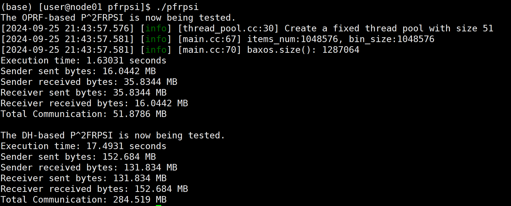

# More Efficient, Privacy-Enhanced, and Powerful Privacy-Preserving Feature Retrieval Private Set Intersection


**We propose two $\mathsf{P^2FRPSI}$ protocols in the semi-honest model, one based on DH key agreement and the other on OPRF, and have comprehensively addressed the current constraints of $\mathsf{P^2FRPSI}$ in terms of performance, privacy, and feature retrieval capability. We implemented them using the [YACL library](https://github.com/secretflow/yacl).**


## YACL's Prequisites

- **bazel**: [.bazelversion](.bazelversion) file describes the recommended version of bazel. We recommend to use the official [bazelisk](https://github.com/bazelbuild/bazelisk?tab=readme-ov-file#installation) to manage bazel version.
- **gcc >= 10.3**
- **[cmake](https://cmake.org/getting-started/)**
- **[ninja/ninja-build](https://ninja-build.org/)**
- **Perl 5 with core modules** (Required by [OpenSSL](https://github.com/openssl/openssl/blob/master/INSTALL.md#prerequisites))

You need to install [Secretflow](https://www.secretflow.org.cn/en/docs/secretflow/v1.9.0b2/) to run our protocols.

## Build
```
git clone https://github.com/secretflow/yacl.git
cd yacl/examples/
git clone https://github.com/ShallMate/pfrpsi.git
cd ..
bazel build --linkopt=-ldl //...
cd examples/pfrpsi
python3 s3r_t.py
cd ../../
cd bazel-bin/examples/pfrpsi
./pfrpsi
```

## Result overview


## NOTE

If you encounter any problems when using this repository, you can ask questions about the issues or contact me directly at gw_ling@sjtu.edu.cn. 
